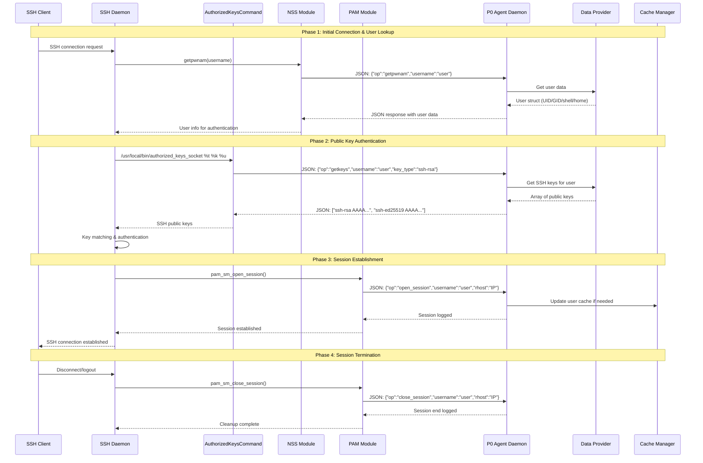
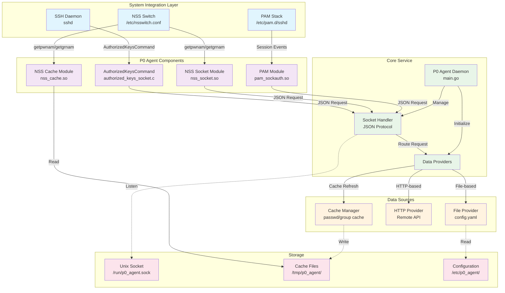

# P0 Agent Repository

This repository contains a complete authentication system with multiple integrated components:

- **cli**: Command-line interface for unified system management and installation
- **daemon**: Central authentication service with user/group management, SSH keys, session tracking, and cache management
- **nss_socket**: Name Service Switch socket module for system user/group lookups via daemon communication
- **nss_cache**: Name Service Switch cache module for high-performance local file-based lookups
- **pam**: Pluggable Authentication Module for session lifecycle management
- **sshd**: SSH authorized keys module for dynamic SSH key authentication
- **sudo**: Group-based sudo configuration system with centralized authorization

## Prerequisites

Before using this repository, ensure you have the following installed:

- **Tools**: For building and managing the components.

```bash
sudo apt update
sudo apt install -y git build-essential gcc pkg-config tmux
git clone https://github.com/p0-security/p0-agent.git
```

## Cloning the Repository

Clone the repository to your local machine:

```bash
git clone <repository-url>
cd p0-agent
```

## Quick Start

### Unified Installation (Recommended)

Use the P0 Agent CLI for simplified installation of all components:

```bash
# Build and install the CLI
cd cli
make build
sudo make install

# Install entire P0 Agent system
sudo p0agent install

# Automatic registration (uses environment from daemon config)
sudo p0agent register --labels "region=us-west;team=backend"

# Manual registration code generation
sudo p0agent register --print-code

# Check system status
p0agent status
```

### Manual Component Installation

Each component can also be built and installed individually:

#### 1. Daemon (Core Service)

```bash
cd daemon
make build
sudo make install
sudo systemctl start p0_agent_daemon
```

#### 2. NSS Socket Module (User/Group Lookups via Daemon)

```bash
cd nss_socket
make
sudo make install
```

#### 3. NSS Cache Module (High-Performance Local Caching)

```bash
cd nss_cache
make
sudo make install
```

#### 4. PAM Module (Session Management)

```bash
cd pam
make
sudo make install
```

#### 5. SSH Module (Dynamic Key Authentication)

```bash
cd sshd
make install-deps
make all
sudo make install
sudo make configure-ssh
```

#### 6. Sudo Configuration (Group-based Authorization)

```bash
cd sudo
sudo make install
```

## SSH Request Lifecycle





## Component Architecture

### P0 Agent CLI (`cli/`)

A unified command-line interface for managing the entire P0 Agent system:

- **Installation Management**: Automated installation of all components
- **Registration**: Generate machine registration codes with SSH host key fingerprints
- **Status Monitoring**: Comprehensive system health checks
- **Configuration**: YAML-based configuration with environment variable support

### Daemon (`daemon/`)

The central authentication service that provides:

- **User/Group Management**: NSS-compatible user and group lookups
- **SSH Key Management**: Dynamic SSH public key retrieval
- **Session Tracking**: PAM session lifecycle monitoring with audit logging
- **Sudo Authorization**: Centralized sudo privilege checking
- **Cache Management**: Automatic population and refresh of NSS cache files
- **Configuration Providers**: File-based and HTTP-based configuration sources
- **Unix Socket API**: JSON-based protocol for component communication

### NSS Socket Module (`nss_socket/`)

Real-time Name Service Switch integration for system authentication:

- **User Lookups**: `getpwnam`, `getpwuid`, `getpwent` operations via daemon socket
- **Group Lookups**: `getgrnam`, `getgrgid`, `getgrent`, `initgroups` operations via daemon socket
- **Socket Communication**: Direct communication with daemon via Unix domain socket
- **Dynamic Data**: Always current data from configured providers (file/HTTP)
- **System Integration**: Seamless integration with system authentication

### NSS Cache Module (`nss_cache/`)

High-performance Name Service Switch caching for system authentication:

- **Local File Access**: Reads from `/tmp/p0_agent/passwd.cache` and `group.cache`
- **High Performance**: No network/socket overhead, direct file system access
- **Automatic Updates**: Cache files managed by daemon with configurable refresh intervals
- **Standard Format**: Uses standard passwd/group file formats for compatibility
- **Fallback Option**: Ideal for high-frequency lookups and system stability

### PAM Module (`pam/`)

Pluggable Authentication Module for session management:

- **Session Lifecycle**: Tracks login/logout events
- **Remote Host Tracking**: Records connection source information
- **Audit Logging**: Comprehensive security audit trails
- **Socket Integration**: Reports session events to daemon

### SSH Module (`sshd/`)

Dynamic SSH public key authentication:

- **AuthorizedKeysCommand**: Replaces static authorized_keys files
- **Key Retrieval**: Fetches SSH keys from daemon in real-time
- **JSON Protocol**: Uses structured communication with daemon
- **Configuration Management**: Automated SSH daemon configuration

### Sudo System (`sudo/`)

Group-based sudo authorization system:

- **Standard Groups**: Uses `p0-agent-admin` and `p0-agent-user` groups
- **Dynamic Assignment**: Automatically assigns users to admin group based on configuration
- **NSS Integration**: Works with existing NSS module for group lookups
- **Reserved GIDs**: Uses GIDs 64200-64201 for consistency across systems

## System Management

### Unified Management

```bash
# Complete system setup
sudo p0agent install --verbose

# Check all component status
p0agent status --detail

# Automatic registration with labels (uses daemon config environment)
sudo p0agent register --labels "region=us-west;team=backend" --verbose

# Generate manual registration code
sudo p0agent register --print-code --details

# Remove entire system
sudo p0agent uninstall
```

### Individual Component Management

```bash
# Daemon management
sudo systemctl start p0_agent_daemon
sudo systemctl enable p0_agent_daemon

# Test NSS integration
getent passwd username
getent group groupname

# Test SSH key retrieval
/usr/local/bin/authorized_keys_socket "ssh-rsa" "fingerprint" "username"

# Test sudo access
sudo -l  # List privileges
```

## Machine Registration

The CLI provides two registration modes:

### Automatic Registration (HTTP Providers)

For HTTP-based providers, the CLI can automatically register with the API:

```bash
# Automatic registration with machine labels (uses daemon config environment)
sudo p0agent register --labels "region=us-west;team=backend"

# Verbose output for debugging
sudo p0agent register --labels "role=database" --verbose
```

**Requirements:**

- Daemon configured with HTTP provider
- API endpoint accessible from the machine
- Network connectivity to the registration endpoint
- Sudo privileges (required to write registration status file)

**API Endpoint:** The CLI automatically calls `{base_url}/register` with machine information.

**Request Format:**

```json
{
  "hostname": "machine-hostname",
  "public_ip": "203.0.113.1",
  "fingerprint": "SHA256:abc123...",
  "public_key": "ssh-ed25519 AAAAC3...",
  "environment_id": "prod-us-west",
  "labels": ["region=us-west", "team=backend"],
  "timestamp": 1234567890
}
```

### Manual Registration

For file-based providers or when automatic registration is not available:

```bash
# Generate registration code for manual entry
sudo p0agent register --print-code --details
```

This generates a registration code that can be manually entered at the registration website.

## Configuration

### Main Configuration (`/etc/p0_agent/config.yaml`)

```yaml
# Provider configuration
provider:
  type: file # or http
  environment: "prod-us-west" # Environment ID for registration (required)

# Logging level
log_level: info

# Cache settings for NSS cache module
cache:
  enabled: true # Enable cache population (default: true)
  refresh_interval: 24 # Hours between full cache refresh (default: 24)
  on_demand_update: true # Update cache when users accessed via socket

# Sudo-enabled users
sudoers:
  - admin
  - miguel

# User definitions
users:
  miguel:
    uid: 2000
    gid: 2000
    gecos: "Miguel Campos"
    dir: "/home/miguel"
    shell: "/bin/bash"
    keys:
      - "ssh-rsa AAAAB3NzaC1yc2E... miguel@example.com"

# Group definitions
groups:
  developers:
    gid: 3000
    members:
      - miguel
```

### HTTP Provider Configuration

```yaml
provider:
  type: http
  environment: "prod-us-west" # Environment ID for registration (required)
  config:
    base_url: "https://api.example.com"
    auth_token: "your-token"
    timeout: 30s
```

## Troubleshooting

### Check System Status

```bash
# Overall system health
p0agent status --detail

# Daemon status and logs
sudo systemctl status p0_agent_daemon
sudo journalctl -u p0_agent_daemon -f

# Test individual components
getent passwd miguel          # NSS module
sudo -l                       # Sudo integration
ssh miguel@localhost          # SSH key authentication
```

### Log Locations

- **Daemon**: `/var/log/p0_agent_daemon.log` or `journalctl -u p0_agent_daemon`
- **SSH**: `/var/log/auth.log` or `/var/log/secure`
- **PAM**: System authentication logs
- **NSS**: Daemon logs include NSS requests

### Common Issues

1. **Socket Permission Errors**: Ensure daemon runs as root
2. **SSH Key Not Found**: Check daemon configuration and user key definitions
3. **Sudo Access Denied**: Verify user is in sudoers list and `p0-agent-admin` group exists
4. **NSS Lookups Failing**: Check `/etc/nsswitch.conf` configuration

## Development and Testing

### Build All Components

```bash
# Build everything
make build-all

# Test installation
sudo make test-install

# Run integration tests
make test
```

### Debug Mode

- **Daemon**: Set `log_level: debug` in configuration
- **NSS**: Build with `make debug`
- **All Components**: Use `--verbose` flag with CLI commands

## Security Notes

- All components communicate via local Unix domain sockets
- SSH public key authentication replaces password authentication
- Group-based sudo access with centralized management
- Comprehensive audit logging for all authentication events
- Configuration requires root privileges to modify

## Tmux Tips

If you are using `tmux` for terminal multiplexing, here are some useful commands:

- Start a new session: `tmux new -s mysession`
- Attach to an existing session: `tmux attach -t mysession`
- Detach from a session: Press `Ctrl-b` then `d`
- List all sessions: `tmux ls`
- Kill a session: `tmux kill-session -t mysession`
- Split window: `Ctrl-b "`
- Navigate between panes: `Ctrl-b` then arrow keys
- Resize panes: `Ctrl-b` then hold `Ctrl` and use arrow keys
